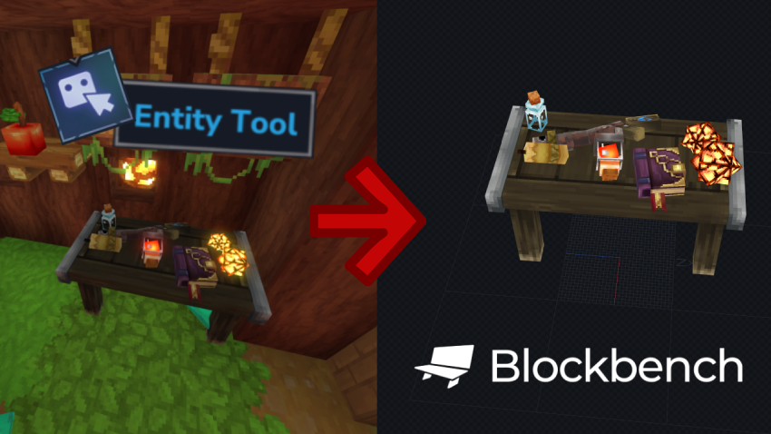

# Model Creator


A Plugin that allows you to create **Blockymodels directly from in-game entities**.

Instead of building models manually in Blockbench, you can select entities in the world and export them as **one Blockymodel with a single combined texture**.

---

# How to use It

1. Select entities in the world (Selection Tool)
2. Run ```/mc g``` Command (Or ```/mcreator generate```)
3. Type in the name of your new Blockymodel
4. Unselect entities you don't want to include
5. Select the pack the Blockymodel should be created in
6. Select if you want to automatically create a new Item with the Blockymodel

---

# Known Issues (Beta)

### This plugin is currently _in Beta_.
### If you encounter any issues, please write a comment or hit me up on any [Social Media](#socials).

### Mob Models

Mob models export, but attachments are not implemented yet
(e.g. deer antlers) (Already in Progress).

---

# Planned Features

Currently working on:
* More precise entity controls via UI
* Entity grouping (Move or rotate multiple entities together)
* Additional utility features

---

# Contributing

Suggestions, ideas, and feedback are welcome.

---

# Socials

### X: [@MarggxDev](https://x.com/MarggxDev)

### Discord: [Marggx](https://discord.gg/Hx5jFT95)

### Twitch: [Marggx](https://www.twitch.tv/marggx)

---
